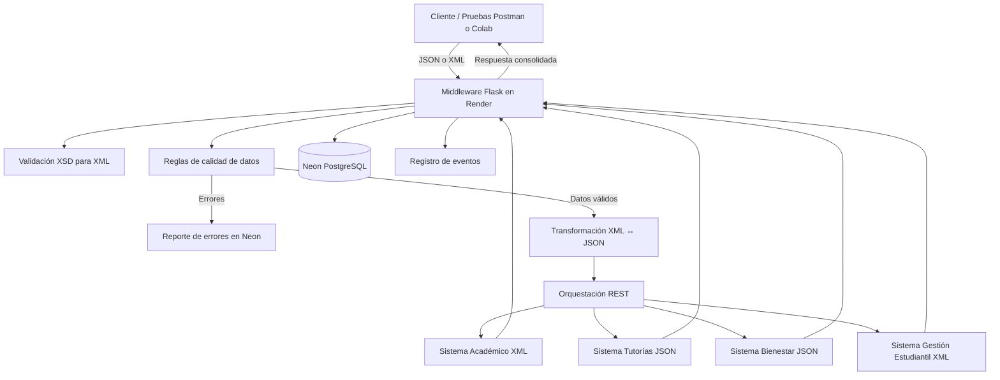

# Diseño de la solución - Arquitectura de integración

## Objetivo

Diseñar e implementar una plataforma de interoperabilidad para integrar los sistemas institucionales de CECAR mediante un middleware central, usando APIs REST, transformación XML/JSON, validación de calidad y almacenamiento en Neon PostgreSQL.

## Componentes

1. **Cliente / Simulador**: envía solicitudes académicas en JSON o XML.
2. **Middleware Flask**: recibe solicitudes, valida datos, transforma formatos, consulta sistemas externos, consolida respuestas y registra eventos.
3. **Sistemas externos simulados**:
   - Sistema Académico: XML.
   - Sistema de Tutorías: JSON.
   - Sistema de Bienestar Universitario: JSON.
   - Sistema de Gestión Estudiantil: XML.
4. **Neon PostgreSQL**: almacena estudiantes, programas, solicitudes, asesorías, eventos y errores de calidad.
5. **Render**: despliega el middleware y los sistemas simulados como servicios web.

## Diagrama de arquitectura

## Flujo principal

1. El cliente envía una solicitud en JSON o XML.
2. Si llega XML, se valida con el archivo XSD.
3. El middleware normaliza los datos a JSON.
4. Se ejecutan reglas de calidad.
5. Si hay errores, se registran en Neon y se responde con el detalle.
6. Si la solicitud es válida, se guarda en Neon.
7. El middleware consulta los sistemas externos simulados.
8. Se consolida una respuesta con datos internos y externos.
9. Se registra el evento de integración.

## Buenas prácticas usadas

- API REST.
- Separación entre middleware y sistemas externos.
- Variables de entorno para credenciales.
- Validación XSD para XML.
- Catálogo de datos.
- Reglas de calidad.
- Persistencia en PostgreSQL.
- Registro de eventos y errores.
